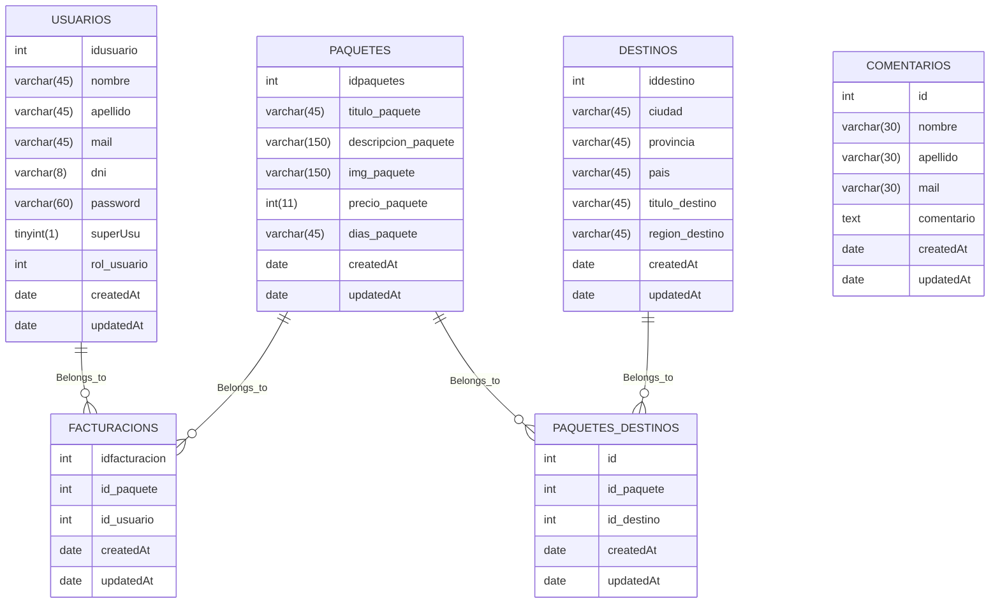

<h1 align="center" style = "margin: 0 auto;  height: 200px; overflow: hidden;" >
  <p align="center">WEB Viajes</p>
  <!-- <a href="" ></a> -->
</h1>

## Tabla de contenidos
- [Tabla de contenidos](#tabla-de-contenidos)
  - [Información General](#información-general)
  - [Link URL base](#link-url-base)
  - [Objeto Paquetes](#objeto-paquetes)
  - [Ruteo de paquetes](#ruteo-de-paquetes)
  - [Peticiones](#peticiones)
  - [Métodos](#métodos)
    - [Método PUT](#método-put)
    - [Metodo POST](#metodo-post)
  - [Graficos](#graficos)
  - [Colaboradores](#colaboradores)

### Información General
***
<div class="warning" style='padding:0.1em; background-color:#E9D8FD; color:#69337A'>
<span>
<p style='margin-left:1em;'>
La web de viajes, es un proyecto para <b>Visualizar,Crear, Actualizar y Eliminar</b> fácilmente paquetes los cuales van a tener un destino, y los usuarios tendran una cuenta donde visualizaran los paquetes comprados.
</p>
</p></span>
</div>
 

### Link URL base
***
<!-- http://localhost:3000/api/v1/ -->
<!-- > http://localhost:3000/api/v1/ -->


### Objeto Paquetes
***
```javascript
// ejemplo de la estructura de paquete
{
    "id":20,
    "titulo_paquete":"Paquete Caba",
    "descripcion_paquete":"Paquete Caba",
    "img_paquete":"/uploads/caba.jpg"
    "precio_paquete":40000,
    "dias_paquete":"5 días"
}
```
### Ruteo de paquetes 
```javascript
--- Index.js ----
const express = require("express");
const app = express();
const cors = require ("cors")
// const viajesRouter = require("./routes/paquetesRouter.js")
const path = require('path');
require('dotenv').config();

const paquetesRouter = require("./routes/paquetesRouter.js")
const usuariosRouter = require("./routes/userRouter.js")
const comentarioRouter = require("./routes/comentarioRouter.js")
const facturacionRouter = require("./routes/facturacionRouter.js")
const paquetesDestinosRouter = require("./routes/paquetesDestinosRoutes.js")
const destonosRouter = require("./routes/destinosRouter.js")
const pdfRouter = require("./routes/pdfRouter.js")
const authenticate = require('./middleware/authenticate.js'); // Importa el middleware de autenticación

const db = require ("./data/bd.js");
app.use(cors());
const PORT = process.env.PORT || 3001;
// app.use("/viajes", viajesRouter)
app.use("/paquetes", paquetesRouter)
app.use ("/usuarios",usuariosRouter)
app.use("/comentarios", comentarioRouter)
app.use("/facturacion", facturacionRouter)
app.use("/pdf", pdfRouter)
app.use("/paquetesDestinos", paquetesDestinosRouter)
app.use("/destinos", destonosRouter)

app.use(express.static(path.join(__dirname, '../frontend/public')));

app.get('/', (req, res) => {
    res.sendFile(path.join(__dirname, '../frontend/public/views/index.html'));
});

app.get("/miperfil", authenticate.soloAdmin, (req, res) => {
    res.sendFile(path.join(__dirname, '../frontend/public/views/miperfil.html'));
});

app.get('/patagonia', (req, res) => {
    res.sendFile(path.join(__dirname, '../frontend/public/views/patagonia.html'));
});

app.get('/norte', (req, res) => {
    res.sendFile(path.join(__dirname, '../frontend/public/views/norte.html'));
});
app.get('/nosotros', (req, res) => {
    res.sendFile(path.join(__dirname, '../frontend/public/views/nosotros.html'));
});
app.get('/contacto', (req, res) => {
    res.sendFile(path.join(__dirname, '../frontend/public/views/contacto.html'));
});

app.get('/login', (req, res) => {
    res.sendFile(path.join(__dirname, '../frontend/public/views/login.html'));
});

app.get('/sesion', (req, res) => {
    res.sendFile(path.join(__dirname, '../frontend/public/views/session.html'));
});

app.get('/register', (req, res) => {
    res.sendFile(path.join(__dirname, '../frontend/public/views/register.html'));
});
//conexion a la base de datos
const conexionDB = async ()=>{
    try {
       await db.authenticate()
       console.log(`conectado ok a la base de datos`);
    } catch (error) {
        console.log(`el error es : ${error}`);
    }
}

app.listen (PORT,()=>{
    conexionDB()
    console.log(`servidor OK : http://localhost:${PORT}`);
})

--------------------paquetesRouter.js-------------------
// en mi archivo paquetesRouter.js

const express = require ("express")
const router= express.Router()
router.use(express.json()); // Middleware para parsear el cuerpo de la solicitud como JSON
const {traerPaquetes,traerunPaquete,crearPaquete,actualizarPaquete,borrarPaquete } = require ("../controllers/paquetesControllers.js")

router.get ("/",traerPaquetes) 
router.get ("/:id",traerunPaquete)
router.post ("/",crearPaquete) 
router.put ("/:id",actualizarPaquete ) 
router.delete ("/:id",borrarPaquete)
// module.exports= router

module.exports= router
```
###  Peticiones 
 ***
| PETICION | URL                                                 | DESCRIPCION                        |
| :------- | :-------------------------------------------------- | :--------------------------------- |
| GET      | [/paquetes](http://localhost:3000/paquetes)         | Obtener todos los paquetes         |
| POST     | [/paquetes](http://localhost:3000/paquetes)         | Agregar un paquete                 |
| PUT      | [/paquetes/:id](http://localhost:3000/paquetes/:id) | Modificar  paquete pasandole el ID |
| DELETE   | [/paquetes/:id](http://localhost:3000/paquetes/:id) | Eliminar paquete pasandole el ID   |  |

### Métodos
#### Método PUT
***
> [!NOTE]  
> Este método va actualizar el paquete recibiendo el Id  y los campos del objeto a modificar en la base de datos
```javascript

const actualizarPaquete= async (req,res)=>{
    try {
        const paqueteExist = await PaquetesModel.findOne({ where: { idpaquetes: req.params.id } });
        if (!paqueteExist) {
            return res.status(404).json({ message: "Paquete no encontrado" });
        }
      console.log(req.body);
      // Consulta con Op.ne (Operador not equal):
         // Si se está intentando cambiar el título del paquete
        if (req.body.titulo_paquete) {
            // Verificar si el nuevo título ya existe en otro paquete
            const paqueteConMismoTitulo = await PaquetesModel.findOne({
                where: {
                    titulo_paquete: req.body.titulo_paquete,
                    idpaquetes: { [Op.ne]: paqueteExist.idpaquetes } // Excluir el paquete actual
                }
            });
            // Si se encuentra un paquete con el mismo título, devolver un error 409 (Conflict)
          if (paqueteConMismoTitulo) {
              console.log('titulo existente')
                return res.status(409).json({ message: "El título ya existe en la base de datos" });
            }
        }
        // Actualizar el paquete con los nuevos datos
        await paqueteExist.update(req.body);
        res.json({"message": "Registro actualizado correctamente"}) 
    } catch (error) {
        res.json({message:error.message}) 
    }
}

```

#### Metodo POST
***
> [!NOTE]  
> Este método crear un nuevo paquete en la base de datos 
```javascript
  const crearPaquete= async (req,res)=>{
    try {
    // Asignar valor por defecto a superUsu si no está presente en el cuerpo de la solicitud
    const { titulo_paquete, descripcion_paquete,img_paquete, precio_paquete, dias_paquete } = req.body;
    const nuevoPaquete = await PaquetesModel.create({
        titulo_paquete,
        descripcion_paquete,
        img_paquete,
        precio_paquete,
        dias_paquete,
    });
    console.log(nuevoPaquete)
       return res.status(201).json({ message: "Paquete creado exitosamente", paquete: nuevoPaquete });
    } catch (error) {
      //  console.error("Error en la solicitud:", error.message);
      console.log(error)
        return res.status(500).json({ message: "Error en el servidor al crear Paquete" });
    }
}
```

<!-- ### Archivo .ENV -->
***
```
```

### Graficos 

### Colaboradores 
***
<!-- <a href="https://github.com/carolinamendez0/IngeniasTpIntegrador/graphs/contributors" target="_blank"> -->
</a>
<!--  -->